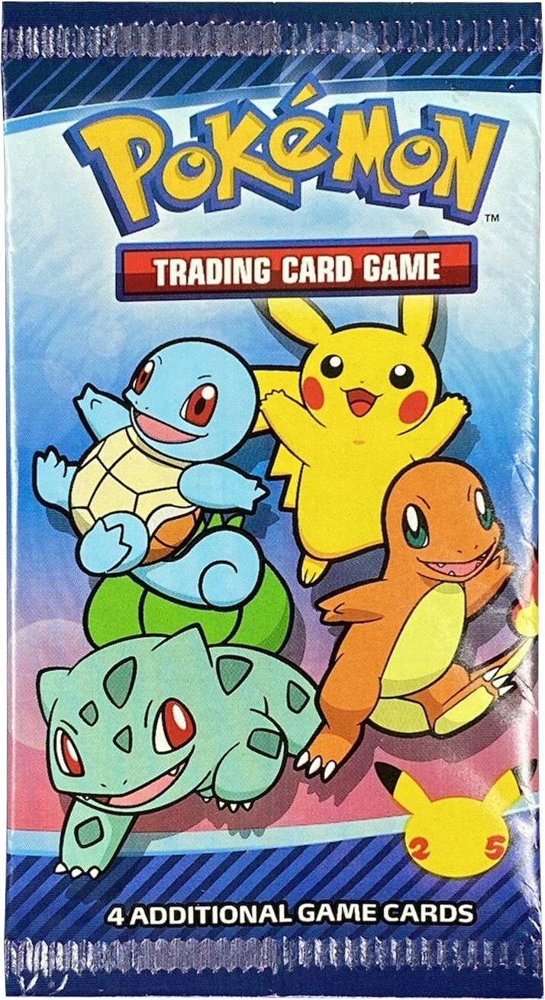

<!-- HTML table fragment for page -->
<table>
  <thead>
  <tr>
    <th>Pokemon</th>
    <th>Upvotes</th>
    <th>Downvotes</th>
  </tr>
  </thead>
  <tbody id="result">
    <!-- javascript generated data -->
  </tbody>
</table>

<!-- Script is layed out in a sequence (without a function) and will execute when page is loaded -->

<html>
<head>
    
</head>
<body>
    
</body>
</html>

<head>
    <meta charset='utf-8'>
    <meta name="viewport" content="width=device-width,
    initial-scale=1">
    <link rel="stylesheet" type="text/css" href="style.css">
    <title>Flip Card</title>
    
</head>

<body>
    

        
    

    

    

</body>

